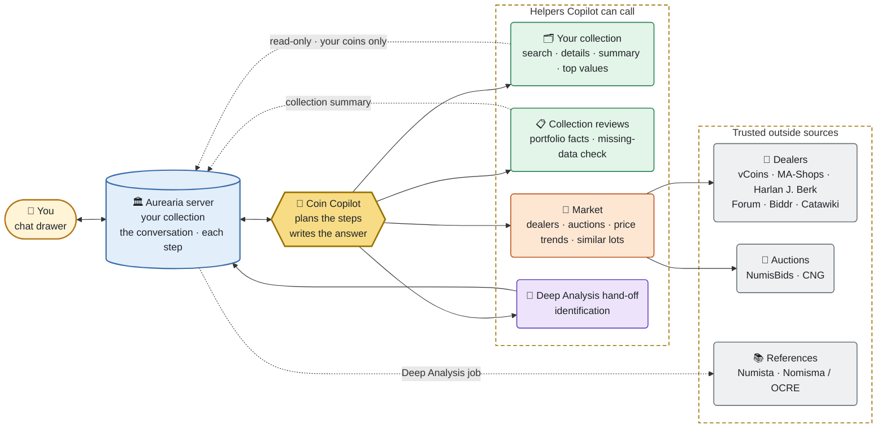
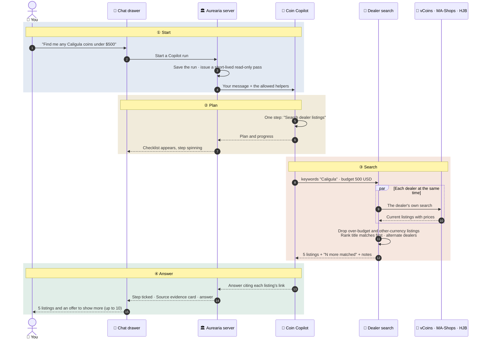
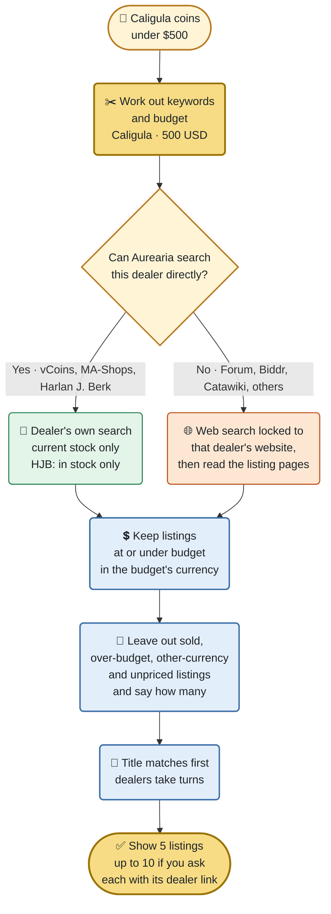
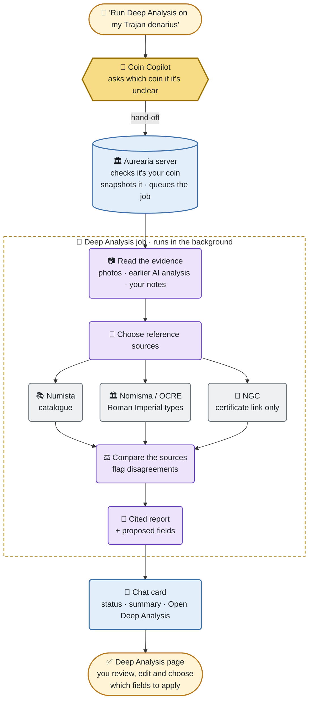
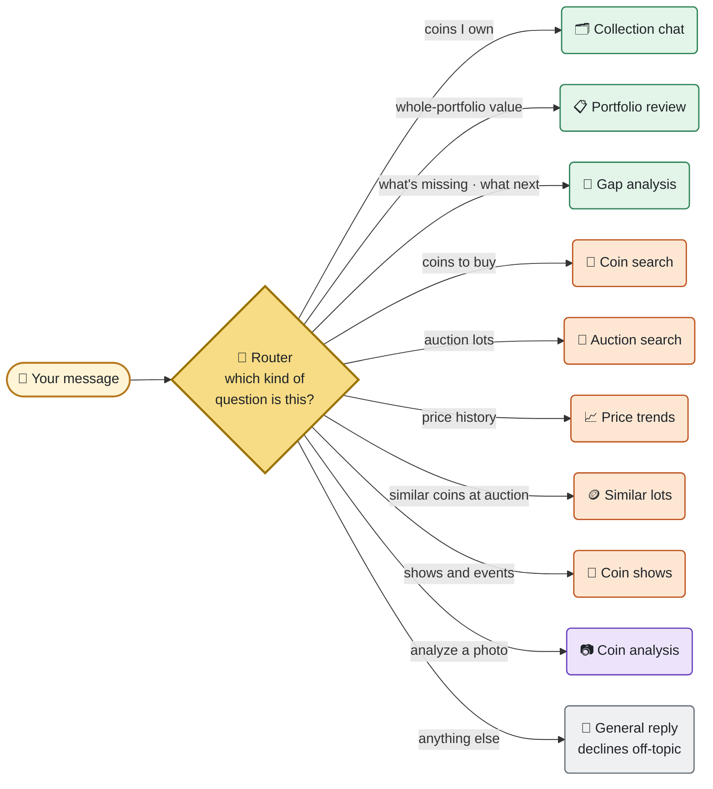

# How Coin Copilot Works: A Collector's Guide

> What happens when you ask the chat assistant a question, which helpers it
> calls on, where it looks, and what it will and won't do with your collection.
> Written for collectors, not AI engineers. The operator reference is
> [Coin Copilot](coin-copilot.md).

## In one paragraph

Coin Copilot is the assistant in Aurearia's chat drawer (open it from
**Agent** in the sidebar, or from the floating button in the installed app).
You ask in plain English: "Find me any Caligula coins under $500", "Which of my
coins are missing an era?", "What have Athenian owls been selling for?". Copilot
works out which steps it needs, asks a small team of specialised helpers to
look things up, and writes one answer that cites where every fact came from.
It is **read-only**: it can look at your collection and search trusted dealer
and auction sites, but it can never change a coin, add to your wishlist, or buy
anything on its own. Anything that changes your data is a button you press.

## Two assistants, one chat box

The chat drawer runs one of two assistants. Your administrator decides which.

| | **Coin Copilot** (newer, beta) | **Coin Agent** (original) |
|---|---|---|
| When it's used | When an admin turns on *Enable Coin Copilot beta* and the AI model supports it | When Copilot is off, or the model can't run it |
| How it works | Plans several steps, calls helpers (up to three at once), then answers | Picks **one** team per message and hands your question to it |
| Shows its work | A checklist of steps and a "Source evidence" card for each search | A single streamed answer |
| Multi-part questions | Yes, e.g. "find Julius Caesar denarii at dealers **and** at auction" | One topic per message |
| Coin shows | **Not available** (see [Known limitations](#known-limitations)) | Yes |
| Asks you questions | Pauses with a clarifying question when your request is truly ambiguous | Rarely; guesses instead |
| Survives closing the drawer | Yes: the run continues on the server and you can reconnect | No |

You can tell which one you're talking to: Copilot answers carry a small
**Beta · Coin Copilot** header with a status such as *Working* or *Complete*.

## The big picture

**Colour key** (same in every diagram): 🟨 gold = Coin Copilot ·
🟦 blue = the Aurearia server · 🟩 green = your collection ·
🟧 orange = market searches · 🟪 purple = identification ·
⬜ grey = outside websites and catalogues.

Three things are worth knowing about this picture:

- **Your collection never leaves the server in bulk.** Collection helpers ask
  the Aurearia server for exactly what a step needs, using a short-lived
  read-only pass that works for one conversation, for your coins only, and
  expires within three minutes.
- **The outside world is a fixed list.** Copilot can only reach the dealer and
  auction sites your administrator configured (*Admin → System → Dealer Search
  Sources / Auction Search Sources*). It cannot browse the open web.
- **Copilot itself remembers nothing between conversations.** The server keeps
  the conversation, the step checklist and the results, so a run can be paused,
  resumed or replayed without the assistant holding anything in memory.

## The helpers

These are the helpers Copilot can call. Each one appears twice in the chat:
under its **checklist name** in the step list, and under its **result name**
on the line that reports what it found.

| Checklist name | Result name | What it does for you | Where it looks | Can it change anything? |
|---|---|---|---|---|
| **Search owned collection** | Search My Collection | Finds your coins matching a description ("my Constantine folles", "coins with no mint") | Your collection | No |
| **Read coin details** | Get Coin | Reads one of your coins in full | Your collection | No |
| **Summarize collection** | Collection Summary | Counts, totals and which fields are missing across the whole collection | Your collection | No |
| **Review top recorded values** | Top Coins By Value | Lists your highest-valued coins by the values you've recorded | Your collection | No |
| **Review collection portfolio** | Portfolio Review | A fact sheet from your own records: number of coins, recorded purchase total vs recorded current value, missing information | Your collection summary only (no market prices) | No |
| **Analyze collection gaps** | Gap Analysis | Finds *data* gaps, e.g. "14 coins are missing an era, 6 have no weight". It does **not** give buying advice | Your collection summary only | No |
| **Search dealer listings** | Market Search | Finds coins currently for sale, keeps to your budget, and marks each listing's source | Configured dealers (see [How dealer search works](#how-dealer-search-works)) | No |
| **Search auction lots** | Auction Search | Finds lots in current and upcoming auctions | Configured auction houses; NumisBids is searched directly | No |
| **Analyze completed-sale price trends** | Price Trends | Looks at recent completed sales and says whether prices look rising, falling or flat, and how many verified sales that's based on | Configured auction houses | No |
| **Find similar auction lots** | Similar Lots | Finds and ranks auction lots similar to a coin you describe | Configured auction houses | No |
| **Use existing Deep Analysis** | Deep Analysis Handoff | Starts, checks or re-runs a Deep Analysis identification job for one of your coins or an open Quick Capture draft | Your coin's photos, then reference catalogues | No: the result is a *proposal* you review on the Deep Analysis page |

Copilot calls at most **three helpers at the same time**, and at most **twelve
per run**. A Deep Analysis start or re-run always runs on its
own, never alongside another helper.

## What happens when you ask

Here is one real question traced end to end:
*"Find me any Caligula coins under $500."*

In words:

1. **Your message goes to the Aurearia server first**, not straight to the AI.
   The server records the run and hands Copilot your message, the helpers it
   may use, and a read-only pass.
2. **Copilot plans.** For a clear request it gets straight on with it. It
   won't ask "shall I search?" when you've already asked it to.
3. **Helpers run** and report back. Every step appears in the chat checklist
   as it starts and finishes, so you can see what it's doing.
4. **Copilot writes the answer** from what the helpers found, keeping each
   listing's link, when it was seen, and any caveats. If a helper found more
   than it showed you, Copilot says how many and offers to show more.
5. **The server saves everything it shows you**, so if you close the drawer or
   lose your connection, reopening the chat picks up where it left off.

### When Copilot asks you a question

If your request is genuinely ambiguous (for example "run Deep Analysis on my
denarius" when you own twelve), Copilot pauses and shows **Coin Copilot needs
clarification** with a question, sometimes with choices. The status reads
*Waiting for your answer*. Answer it and the same run continues; a paused
question stays answerable for 7 days. Budget, denomination and condition are
optional; Copilot won't stop to ask for them.

### Stopping a run

Press **Cancel run** at any time. The server's decision is final: anything a
helper returns after you cancel is thrown away.

## How dealer search works

Dealer search is where most shopping questions end up, so it's worth knowing
what happens inside it.

- **Why "directly" matters.** A general web search turns up years of old
  listing pages for coins that sold long ago. Searching the dealer's own site
  only returns what they have *now*, so sold coins don't appear. Aurearia does
  this for vCoins, MA-Shops and Harlan J. Berk. For Harlan J. Berk it also asks
  for items with stock on hand, because their feed keeps closed sale lots.
- **Other dealers** still go through a web search, but the search is locked to
  that dealer's website. Listings found this way may be marked *partially
  verified* with unknown availability. Check the listing before relying on it.
- **Budgets never convert currencies.** "Under $500" keeps US-dollar listings
  at or under $500. Listings priced in euros or pounds are left out, and the
  answer tells you how many (for example "30 listings priced in another
  currency were left out"). Aurearia doesn't use exchange rates, so it can't
  fairly compare €450 with $500.
- **Five by default.** You'll see 5 listings. If more matched, Copilot says so
  and offers to show more, up to a maximum of 10.
- **Add to Wishlist** appears on dealer listings. Pressing it asks you to
  confirm; Copilot never adds anything itself.

## Deep Analysis hand-off

Deep Analysis is Aurearia's slower, more thorough identification workflow. It
compares your coin's photos with reference catalogues and writes a cited
report. If your administrator has enabled it for Copilot, you can start it
from the chat ("run Deep Analysis on my Trajan denarius").

- The chat card shows progress, a short summary, where sources disagree, and
  which sources were checked. Its only button is **Open Deep Analysis**.
- **Nothing is applied from the chat.** You review the proposal on the Deep
  Analysis page and choose, field by field, what to save.
- Leaving the page doesn't stop the job. One reference source failing doesn't
  throw away the others' evidence.
- RPC (Roman Provincial Coinage) isn't automated: it has no supported API.
  See [Deep Analysis](deep-analysis.md) for details.

## Reading the results

**Run status** (top right of the Copilot header):

| Status | Meaning |
|---|---|
| Queued | Waiting its turn on the server |
| Working | Planning or running helpers |
| Waiting for your answer | Paused on a clarifying question |
| Cancelling / Cancelled | You pressed Cancel run |
| Complete | Finished normally |
| Stopped | Ended early, e.g. a limit was reached or the AI service failed |

**The Source evidence card** under each search step shows what came back and
how much to trust it:

| Label | Meaning |
|---|---|
| Complete | Every source answered |
| Partial | Some sources answered, at least one didn't (for example a dealer was temporarily blocking automated searches) |
| No match | The sources answered but had nothing matching |
| Unavailable | The sources couldn't be reached |

Other things you may see:

- **Verified vs partially verified.** Verified listings were read from the
  dealer's own search or page. Partially verified ones come from search-engine
  snippets, so availability is unknown.
- **"Result details were shortened."** A step returned more than the chat keeps.
  Copilot will say evidence was omitted and won't pretend it read it.
- **Price trends** show the direction, the number of *verified sales* behind it,
  and the date range. Hammer prices and prices including buyer's premium are
  kept separate and never mixed.
- **Save as Note.** Any finished answer can be saved to your Notes after you
  review and edit it.

## What Copilot will never do

- Change a coin, draft, wishlist item, collector profile or setting.
- Buy, bid, or approve anything.
- Browse arbitrary websites or reach sites outside the configured lists.
- Follow instructions that appear *inside* a dealer page or search result.
  Text from the outside world is treated as information, never as orders.
- Convert currencies, or mix hammer prices with premium-inclusive prices.
- Show you its private reasoning, internal prompts or any credentials.
- Remember you between conversations beyond the saved chat history.

## Your collector profile

If you fill in **Settings → Collector Profile** (budget range, currency,
preferred periods and categories, excluded categories, preferred dealers,
collecting goals), Copilot can take it into account, for example when you ask
for curator-style guidance. It is treated as a hint from you, never as proof of
what you own, and Copilot keeps "facts from your collection" separate from
"suggestions based on your profile".

## Privacy and what's kept

The Aurearia server keeps Copilot's conversation so runs can resume and you can
scroll back. It keeps only what the chat shows: messages, the step checklist,
and bounded helper results. It never keeps the AI's private reasoning, internal
prompts, credentials, or raw copies of your collection.

| What | Kept for |
|---|---|
| Live progress events | 7 days after the run ends |
| Step checkpoints and helper results | 30 days after the run ends |
| A paused question you haven't answered | 7 days |
| Final answers and your messages | Until you delete them |

Searches send your *search terms* (for example "Caligula") to the configured
dealer and auction sites, the same as searching them yourself. Your collection
isn't sent to those sites.

## Built-in limits

Your administrator can adjust these in *Admin → System → Coin Copilot Limits*.

| Limit | Default | Why it exists |
|---|---|---|
| Planning rounds per run | 8 | Stops a run going round in circles |
| Helper calls per run | 12 | Keeps runs focused and costs predictable |
| Helpers at the same time | 3 | Keeps load on dealer sites polite |
| Time per run | 120 seconds | No run hangs forever |
| Active runs per person | 1 | One conversation at a time each |
| Listings per search | 5 (up to 10 on request) | Enough to choose from without a wall of results |

## Known limitations

- **Coin shows aren't a Copilot helper yet.** With Copilot on, "find coin shows
  near me" gets a polite decline. The original Coin Agent can find shows; an
  admin can switch Copilot off to use it. Adding show search to Copilot is
  tracked in [#766](https://github.com/briandenicola/Aurearia/issues/766).
- **Dealers can block automated searches.** vCoins uses bot protection and may
  temporarily refuse searches after many in a short time. The result is then
  *Partial*: that dealer is listed as unavailable and the others still show.
  Aurearia doesn't try to get around this.
- **Keyword search can't judge meaning.** Dealers search their own titles and
  descriptions, so a listing that merely *mentions* Caligula (a Germanicus coin
  "struck under Caligula", or a dealer's colourful description) can appear.
  Listings with the coin in the title are ranked first.
- **Currencies aren't converted**, so a euro listing that would fit your
  dollar budget is left out (and counted).
- **Dealers without direct search** can still show listings whose availability
  is unknown. Check the dealer page before buying.
- **It's an AI.** Copilot's wording, and how it chooses keywords, can vary.
  Every listing links to its source; the source is always the final word.

## Troubleshooting

| What you see | Likely reason | What to try |
|---|---|---|
| No **Beta · Coin Copilot** header; answers come in one go | Copilot is off, or the AI model can't run it | Ask your admin to enable *Coin Copilot beta* with an Anthropic model, or an Ollama model that supports tools |
| "Market Search — Dealer search returned partial evidence; at least one source failed." | One dealer didn't answer (timeout or bot check) | Try again later; the other dealers' results are still valid |
| Fewer results than expected under a budget | Listings in other currencies, or without a readable price, were left out | Read the note under the results; ask without a budget to see everything |
| "Stopped" | A limit was reached or the AI service failed | Ask a narrower question, or try again |
| Copilot won't run Deep Analysis | The hand-off isn't enabled, or it couldn't tell which coin you meant | Name the coin more exactly, or ask your admin (see below) |
| Coin shows are declined | Not a Copilot helper yet | Use the original Coin Agent (Copilot off) |

## The original Coin Agent

When Copilot is off, the chat uses the original **Coin Agent**. A router reads
each message and sends it to exactly one team.

| Team | What it does |
|---|---|
| Collection chat | Answers questions about your own coins and can *propose* an edit, which you confirm before anything is saved |
| Coin search | Finds dealer listings through a web search limited to your configured dealers (at most 10). It doesn't use Copilot's direct dealer search, so sold listings are more likely to slip through |
| Coin shows | Finds upcoming shows and checks the dates haven't passed or been cancelled |
| Coin analysis | Describes a coin from photos: attribution, design, legends, condition |
| Portfolio review | Summarises your holdings and compares recorded values with live dealer prices |
| Gap analysis | Suggests what to collect next based on your collection's spread |
| Price trends | Summarises recent auction results for a coin type |
| Similar lots | Finds and ranks auction lots similar to a coin |
| Auction search | Finds current and upcoming auction lots |

Note the difference: the Coin Agent's *gap analysis* suggests purchases, while
Copilot's *Analyze collection gaps* only reports missing information in your
records.

## Other AI helpers elsewhere in Aurearia

The same AI service powers several features outside the chat. They aren't part
of Copilot, but they're useful to know about.

| Feature | Where you find it | What the AI does |
|---|---|---|
| Quick Identify | Identify Coin | Reads your photos and notes, drafts the basic details, spots NGC slabs, and can suggest a rough price range if you tick the box |
| AI Analysis | A coin's detail page | Writes a numismatic description of the obverse and reverse |
| Grade estimate | A coin's detail page | Estimates a grade from wear, surfaces and strike |
| Estimate Value | A coin's detail page | Estimates a current value from comparable dealer listings |
| Add Coin assisted capture | Add Coin | Drafts a new coin record from photos and an optional coin card |
| Deep Analysis | Identify Coin, or a saved coin | The multi-source identification described above |
| Wishlist from a link | Wishlist | Reads a dealer page you paste and fills in the wishlist item |
| Wishlist availability check | Runs on a schedule | Checks whether wishlist listings are still for sale |
| Wishlist search alerts | Runs on a schedule | Looks for new listings matching your saved searches |
| Bid recommendation | Auction tracking | Adds a market signal from recent sales to a tracked lot |
| Dynamic set builder | Coin Sets | Turns "all twelve Caesars" into a proposed set for you to review |
| Coin of the Day (wishlist) | Coin of the Day | Writes a short note on why a wishlist coin is worth a look |

## For administrators

- **Turn Copilot on:** *Admin → System → Coin Copilot → Enable Coin Copilot
  beta*. It's off by default. It needs a model that can use tools: Anthropic, or
  an Ollama model that advertises tool support. If the model can't, the chat
  quietly uses the original Coin Agent.
- **Choose sources:** *Admin → System → Dealer Search Sources* and *Auction
  Search Sources*. vCoins, MA-Shops and Harlan J. Berk get direct search when
  listed; others use web search limited to their site.
- **Deep Analysis from the chat** needs *Enable Deep Analysis* (Admin → System)
  and the `CoinCopilotAttributionEnabled` setting, which has no switch in the
  admin screen yet and is set through the settings API.
- **Switching Copilot off** stops new runs and returns the chat to the Coin
  Agent. Existing conversations stay readable.

Technical details (limits, retention, recovery, rollback) are in
[Coin Copilot](coin-copilot.md). The original assistant is covered in
[Coin Agent](ai-search-agent.md).

## Glossary

| Term | Plain meaning |
|---|---|
| Agent / assistant | The AI you chat with. Aurearia has two: Coin Copilot and the original Coin Agent |
| Helper (tool) | A specialised task Copilot can ask for, like "search dealer listings" |
| Run | One request from you and everything Copilot does to answer it |
| Source | A website or catalogue the answer came from, always linked |
| Verified / partially verified | Read from the dealer's own site vs pieced together from search-engine snippets |
| Hammer price | The winning bid at auction, before buyer's premium |
| Premium-inclusive price | Hammer price plus the auction house's buyer's premium |
| Deep Analysis | Aurearia's thorough, multi-source identification workflow |
| Read-only | Can look, can't change |
